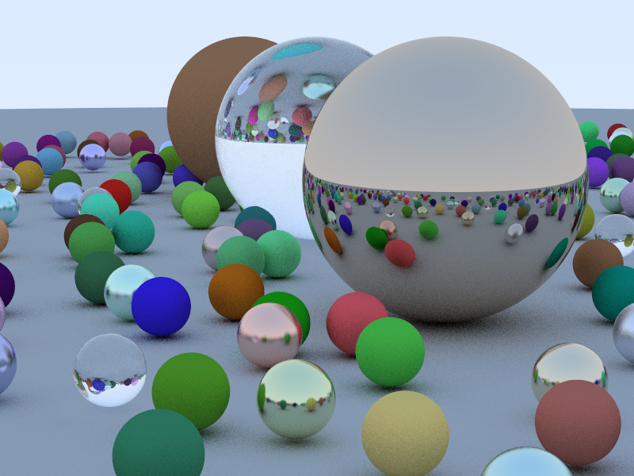

# DBRayTracerJulia

[](https://dev.azure.com/danielbeard0/danielbeard0/_build/latest?definitionId=2) 



- This is a Julia port of the Swift raytracer here: [DBRayTracer](https://github.com/daniel-beard/DBRaytracer)

## Running

You can run this either single threaded by not passing a `--threads` argument, or with multiple threads.

```bash
julia --threads 12 raytracer.jl
```

